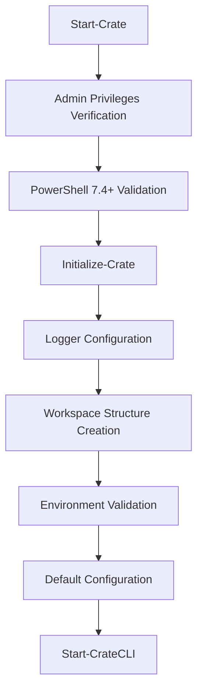
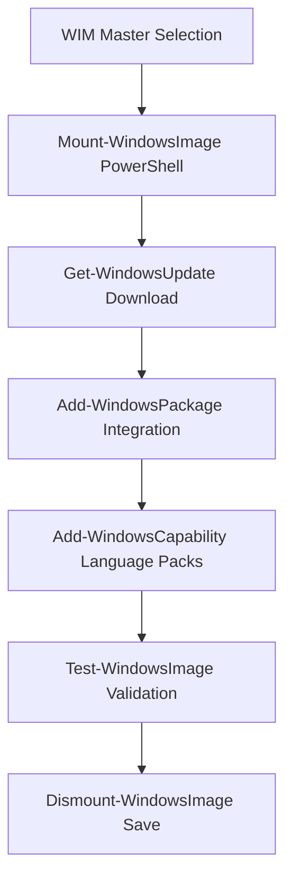

# Crate PowerShell Module Architecture

## Overview

**Crate** is a modern Windows ISO provisioning tool with an interactive CLI interface. It allows mounting, provisioning, and dismounting ISO images with integrated updates and language packs.

## Project Objectives

### Functional Requirements

- 🔧 **WIM Provisioning**: Automation of Windows WIM file update processes using PowerShell cmdlets
- 📦 **Update Management**: Automatic download and integration of Windows updates via PowerShell
- 🌍 **Multilingual Support**: Integration of language packs into images using native PowerShell commands
- 💾 **Cache Management**: Optimization of update and resource storage
- 📊 **Modern Interface**: Interactive CLI with arrow key navigation
- 🔐 **Security**: Mandatory administrator privilege verification

### Technical Requirements

- **PowerShell 7.4+**: Compatibility with latest PowerShell versions and native cmdlets
- **Modular Architecture**: Clear separation of responsibilities
- **Advanced Logging**: Complete operation traceability
- **Robust Error Handling**: Error recovery and reporting
- **Flexible Configuration**: Customization of paths and parameters
- **PowerShell-Native**: Exclusive use of PowerShell cmdlets without external dependencies

## Technical Architecture

### Modular Structure

```text
Crate/
├── Public/           # Exported functions (public API)
│   └── Start-Crate.ps1
├── Private/          # Internal functions
│   ├── Core/         # Core functionalities
│   ├── UI/           # User interface
│   ├── Configuration/# Configuration management
│   ├── ISO/          # ISO operations
│   ├── WIM/          # WIM operations
│   ├── LanguagePacks/# Language pack management
│   ├── Updates/      # Update management
│   ├── Validation/   # Validation controls
│   └── Workflows/    # Workflows
├── Classes/          # PowerShell classes
│   └── CrateLogger.ps1
└── Imports.ps1       # Module variables
```

### Main Components

#### 1. **Crate Logger (Classes/CrateLogger.ps1)**

- **Responsibility**: Centralized logging with severity levels
- **Features**:
  - Automatic log file rotation
  - Silent mode support for automation
  - Timestamp formatting and caller tracking
  - Methods: Write(), StartOperation(), EndOperation(), Progress()

#### 2. **Core Engine (Private/Core/)**

- **Initialize-Crate**: Main entry point, environment validation
- **Start-CrateCLI**: Main interactive CLI interface
- **Get-CrateVersion**: Version management and update checking
- **Test-CrateModuleUpdate**: Automatic module update control

#### 3. **PowerShell WIM Operations (Private/WIM/)**

- **Mount-WimImage**: PowerShell-based WIM mounting using native cmdlets
- **Add-WindowsUpdate**: Integration of updates using PowerShell modules
- **Add-LanguagePack**: Language pack addition via PowerShell
- **Dismount-WimImage**: Clean dismounting and saving operations

#### 4. **User Interface (Private/UI/)**

- **Show-CrateMenu**: Interactive menu with keyboard navigation
- **Show-CrateLogo**: ASCII art branding
- **Show-CrateFooter**: Version information and credits
- **Write-CenteredHost**: Centered display utility

### Configuration Management (Private/Configuration/)**

- **Set-CrateConsoleSize**: Console size optimization (100x50)
- **Restore-CrateConsoleSize**: Original settings restoration

### PowerShell-Native Approach

**Crate exclusively uses PowerShell cmdlets and modules**, avoiding external dependencies like DISM.exe. This approach provides:

#### Key PowerShell Modules Used

- **DISM PowerShell Module**: `Mount-WindowsImage`, `Dismount-WindowsImage`, `Add-WindowsPackage`
- **Windows Update Module**: `Get-WindowsUpdate`, `Install-WindowsUpdate`
- **Storage Module**: `Mount-DiskImage`, `Dismount-DiskImage`
- **Archive Module**: `Expand-Archive`, `Compress-Archive`

#### Benefits of PowerShell-Only Approach

- ✅ **Better Error Handling**: Native PowerShell exception management
- ✅ **Consistent Logging**: Integrated with PowerShell pipeline and logging
- ✅ **Cross-Platform Potential**: Future compatibility with PowerShell Core
- ✅ **No External Dependencies**: Eliminates DISM.exe path issues
- ✅ **Object-Oriented**: Rich PowerShell objects instead of text parsing
- ✅ **Pipeline Integration**: Native PowerShell workflow support

#### Example PowerShell Workflow

```powershell
# Mount WIM using PowerShell
$MountPath = "C:\Mount"
Mount-WindowsImage -ImagePath "install.wim" -Index 1 -Path $MountPath

# Add updates using PowerShell
Get-ChildItem "Updates\*.msu" | ForEach-Object {
    Add-WindowsPackage -Path $MountPath -PackagePath $_.FullName
}

# Add language packs
Add-WindowsCapability -Path $MountPath -Name "Language.Basic~~~fr-FR~0.0.1.0"

# Dismount and save
Dismount-WindowsImage -Path $MountPath -Save
```

### Data Flow and Workflows

#### Initialization Workflow



#### WIM Provisioning Workflow



### Workspace

Default workspace folder structure:

```text
C:\ProgramData\Crate\
├── Config/
│   ├── profiles/      # Configuration profiles
│   ├── cache/         # Configuration cache
│   └── settings.json  # Main configuration
├── Workspace/
│   ├── ISO/           # Mounted ISO images
│   ├── WIM/           # Working WIM files
│   └── Temp/          # Temporary files
├── Downloads/
│   ├── Updates/       # Windows updates
│   └── LanguagePacks/ # Language packs
├── Backup/            # Backups
└── Logs/              # Log files
    └── Crate.log
```

### System Configuration

#### Technical Prerequisites

- **OS**: Windows 10/11 or Windows Server 2016+
- **PowerShell**: Version 7.4 or higher
- **Privileges**: Administrator required
- **Disk Space**: Minimum 10 GB available
- **PowerShell Modules**: Windows Update and DISM PowerShell modules
- **Native Dependencies**: No external tools required (DISM-free approach)

#### Global Variables

```powershell
$Script:CrateLogger      # Global logger instance
$Script:CrateWorkspace   # Current workspace path
$Script:CrateInitialized # Initialization state
$Script:CrateVersion     # Current module version
```

## Extensibility and Maintenance

### Extension Points

1. **New workflows**: Addition in `Private/Workflows/`
2. **Update sources**: Extension `Private/Updates/` using PowerShell modules
3. **Image formats**: Support for new formats in `Private/ISO/` with native cmdlets
4. **Validation methods**: Addition of controls `Private/Validation/` using PowerShell testing

### Modularity

- Each component is independent and testable
- Clear interfaces between layers
- Dependency injection via script variables
- Strict Public/Private separation

### Error Handling

- **Try-Catch** systematic in all critical functions
- **Automatic logging** of errors with stack trace
- **Automatic rollback** in case of operation failure
- **Pre-validation** before any destructive operation

## Security and Best Practices

### Security

- ✅ Mandatory administrator privilege verification
- ✅ Input path and parameter validation
- ✅ Operation isolation in dedicated workspaces
- ✅ Complete logging for audit and traceability

### Performance

- 📈 Smart caching of downloaded resources
- 📈 Parallel processing of long operations
- 📈 Memory optimization for large WIM files
- 📈 Automatic cleanup of temporary files

### Maintainability

- 📚 Complete function documentation
- 🧪 Unit tests with Pester
- 🔧 Automated build with InvokeBuild
- 📝 Documentation generation with platyPS

## Roadmap and Future Evolution

### Features to Implement

- [ ] **Complete WIM provisioning workflow using PowerShell cmdlets**
- [ ] **Advanced configuration interface**
- [ ] **Automatic update management with PowerShell Update modules**
- [ ] **Custom driver support via PowerShell**
- [ ] **Predefined configuration templates**
- [ ] **Optional web interface**
- [ ] **PowerShell DSC support**

### Technical Improvements

- [ ] **Complete integration tests**
- [ ] **Operation parallelization**
- [ ] **Multi-tenancy support**
- [ ] **Optional REST API**
- [ ] **Docker packaging**

---

**Author**: Mickaël CHAVE
**Version**: 25.5.26.1
**Repository**: <https://github.com/mchave3/Crate>
**License**: MIT